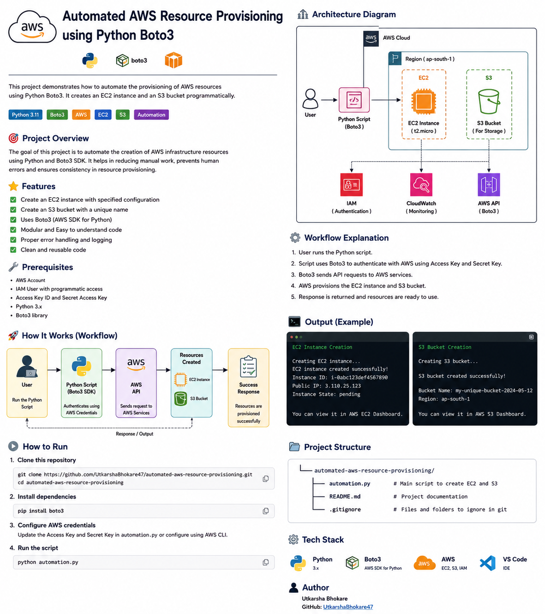

# Automated AWS Resource Provisioning using Boto3

## Project Overview

This project demonstrates Infrastructure Automation using Python and AWS Boto3 SDK. Instead of manually creating AWS resources through the AWS Management Console, resources are provisioned programmatically using Python scripts.

The automation script connects to AWS services through Boto3 and creates cloud resources such as EC2 instances and S3 buckets efficiently.

## AWS Services Used

- AWS IAM
- Amazon EC2
- Amazon S3
- Python Boto3

## Workflow

Developer │ ▼ Python Script │ ▼ Boto3 SDK │ ▼ AWS API │ ┌──┴──┐ ▼ ▼ EC2 S3

## Features

Automate AWS infrastructure provisioning
Eliminate repetitive manual tasks
Implement Infrastructure as Code (IaC) concepts
Learn AWS SDK (Boto3) integration with Python

## Setup

Install boto3:

pip install boto3

Configure AWS credentials:

aws configure

Provide:

AWS Access Key ID
AWS Secret Access Key
Default Region
Output Format

Run project:

python automation.py

## Architecture Diagram

## Output

EC2 Instance Created Successfully
S3 Bucket Created Successfully

🎓 Learning Outcomes

AWS SDK (Boto3) Fundamentals
EC2 Automation
S3 Automation
IAM Credential Management
Infrastructure as Code (IaC) Concepts
Cloud Resource Provisioning using Python

